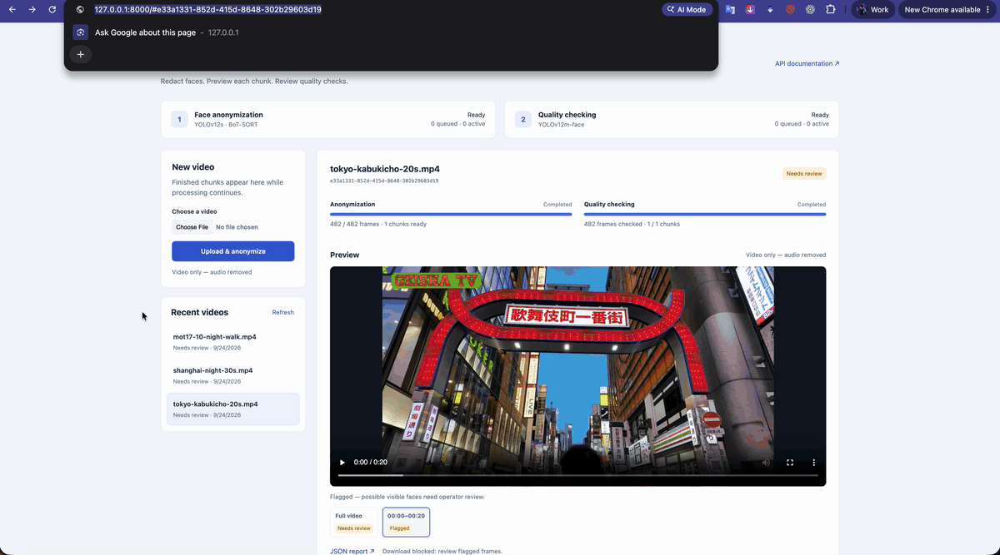
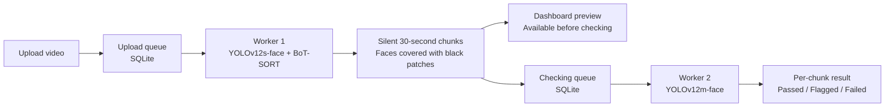

# Face Anonymizer

A local dashboard that covers faces in body-camera videos with black patches, then checks the encoded result with a larger model. **Generated videos have no audio.**



## Run

Use Python 3.12 on macOS or Linux:

```sh
python3.12 -m venv .venv
source .venv/bin/activate
pip install -r requirements.txt
python -m anonymizer.models
python -m anonymizer
```

Open **http://127.0.0.1:8000/** to upload videos, preview chunks, and inspect flagged timestamps. API documentation is at **/docs**. Apple Silicon uses MPS automatically; set `DEVICE=cpu` to use CPU. Ctrl+C stops the application.

## Model choice

During development, RetinaFace produced noisy flags, including regions already anonymized and random patches detecting as faces. Even using a temporal smoothing the results were not that good making manual review less useful.

**YOLOv12m-face** was chosen as a better fit for checking: it provides more capacity than the **YOLOv12s-face** anonymizer and uses the existing batching and MPS runtime. The larger model is intended to catch faces left by the smaller model. Broader evaluation will measure the difference in missed faces and false flags.

This is an intentional change from the assignment's RetinaFace requirement.

## Pipeline



1. **Upload:** Stream the video to disk and queue it in SQLite. Repeated or simultaneous events with the same `upload_id` return the existing job. Reuse an ID only for the same video.
2. **Anonymize:** Detect faces on every frame. BoT-SORT handles camera movement and brief detection gaps. Apply padded black patches and publish finished, silent H.264 chunks near 30-second boundaries, including the final shorter chunk.
3. **Check:** Inspect every encoded frame with one full-frame YOLOv12m-face pass, batched for efficiency. Matching detections in **5 of 6 frames** become persistent; brief findings remain unconfirmed. Both categories block downloads. Matching continues across batches and chunks, resetting at detected scene cuts.
4. **Review:** Preview chunks immediately and click findings to inspect timestamps and boxes. Assemble the full video without re-encoding. Downloads require complete checking with no findings. Flags produce `needs_review`; errors or incomplete checks produce `failed`. Flagged previews are for local review.

## Workers and recovery

`python -m anonymizer` starts the API and two worker processes. Each worker consumes its queue sequentially; checking runs alongside anonymization. SQLite transactions claim work, and process locks allow one worker per role. No external queue service is needed.

To run the services separately, use one terminal per command:

| Service | Command | Responsibility |
|---|---|---|
| API | `python -m anonymizer --role api` | Uploads, dashboard, progress, and downloads |
| Anonymizer | `python -m anonymizer --role redact` | Upload queue, tracking, masks, and chunk publication |
| Checker | `python -m anonymizer --role check` | Chunk queue, findings, and final report |

Run one application instance per data directory and keep `data/` between restarts. API restarts preserve progress. The checker retries interrupted chunks; the anonymizer replays the source to rebuild tracking while retaining published chunks. Each job saves its processing settings.

The single-pass checker upgrade rechecks all chunks of unfinished older jobs while retaining their redacted videos. Finished jobs retain their original reports; submit a new upload ID to use the new checker.

## Configuration

Processing defaults are in [anonymizer/config.py](anonymizer/config.py):

| Setting | Anonymizer | Checker |
|---|---|---|
| Model | YOLOv12s-face | YOLOv12m-face |
| Confidence threshold | `0.65` | `0.70` |
| Input size | `960` | `960` |
| Batch size | `4` | `4` |

Masks add **20% padding per side**. Tracking bridges gaps up to **0.3 seconds**; candidates down to **0.20 confidence** can maintain existing tracks.

## Evaluation strategy

- **Coverage:** Use separate tuning and evaluation clips spanning crowded streets, indoor scenes, low light, camera motion, blur, occlusion, unusual viewpoints, different resolutions, and longer recordings.
- **Visual accuracy:** Annotate visible faces and compare source/output pairs. Count uncovered faces, unnecessary masks, false flags, and checker misses. Compare models on identical encoded videos, report results by scene, and use unredacted footage as a positive control.
- **Reliability:** Exercise duplicate events, independent worker restarts, invalid media, interrupted checking, chunk-boundary continuity, and blocked downloads. Check frame counts, timing, orientation, playback, and audio removal.
- **Performance:** Measure processing time, throughput, and peak memory on short clips and a five-minute recording. Confirm memory stays bounded as video length increases.

Completed checks covered CPU/MPS, full and partial batches, duplicate uploads, migration/restart, dashboard seeking, audio removal, and Docker CPU inference. The single-pass pipeline was rechecked on short supermarket, street, night, and face-free clips with **all 148 frames checked**; previews, download gates, and silent outputs passed. An unredacted supermarket clip also triggered checker flags. Earlier manual inspection found a shelf-graphic false positive and missed side-facing faces. The broader evaluation above remains pending; a measured accuracy advantage has not been established.

## Limitations and production

Small, obscured, dark, or angled faces remain challenging, and some background patterns can produce false flags. A passed check means no remaining faces were detected; it does **not** guarantee anonymity. Checking may run slower than playback. Production deployment would need authentication, authorized review, retention limits, resource isolation, and monitoring.

**Future enhancement:** Optional tiled detection, rotated views, and dark-image enhancement could improve coverage of difficult faces, at the cost of extra inference time. The current checker uses only the original full frame.
